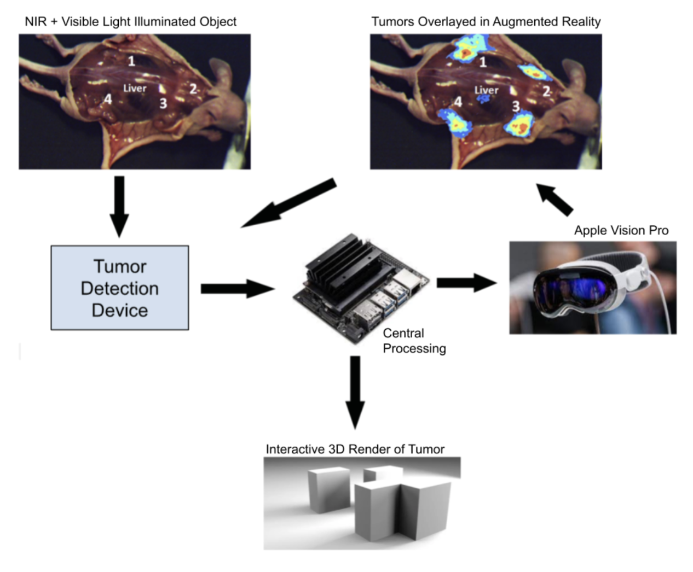
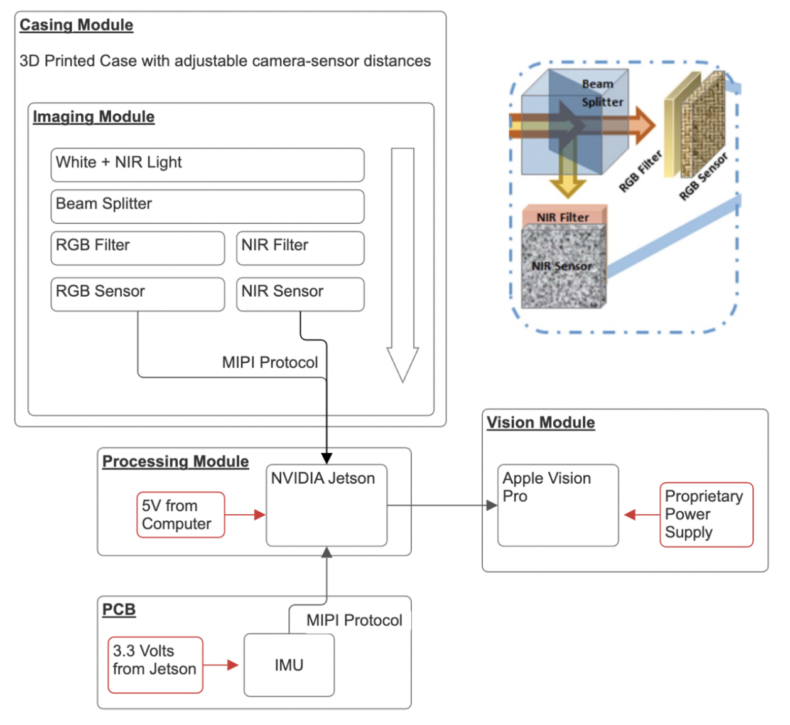
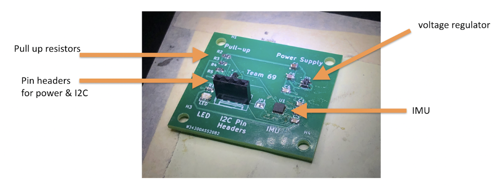
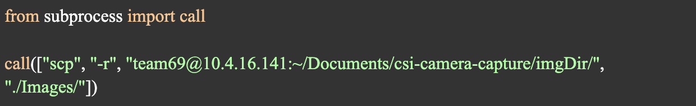
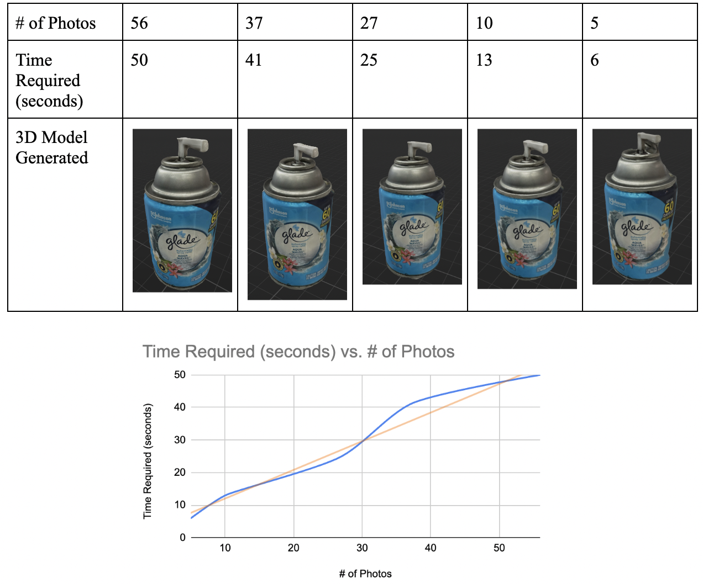
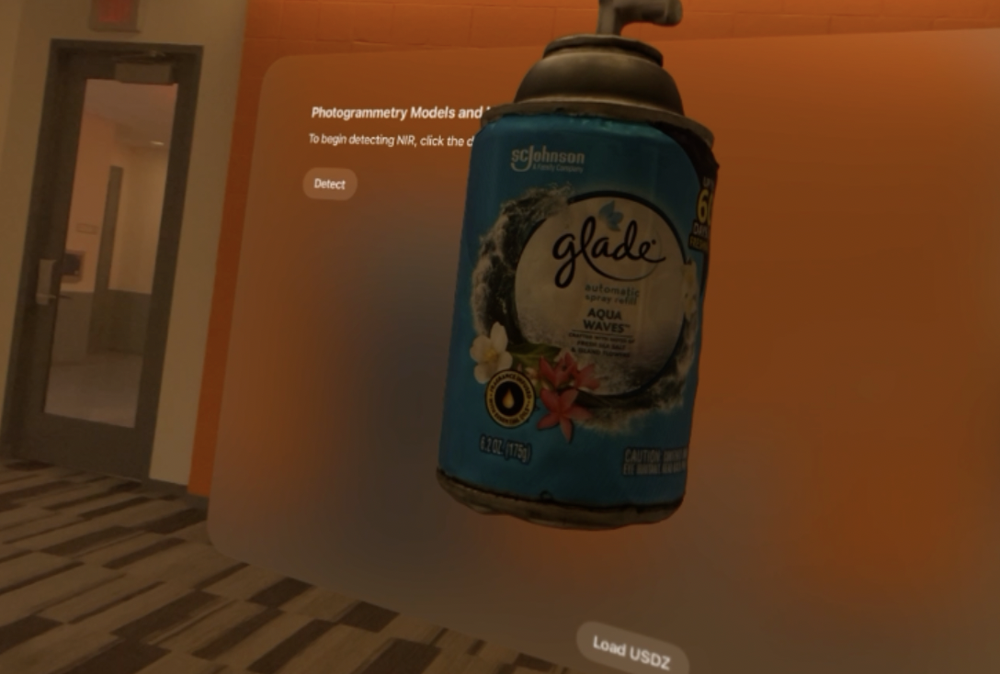
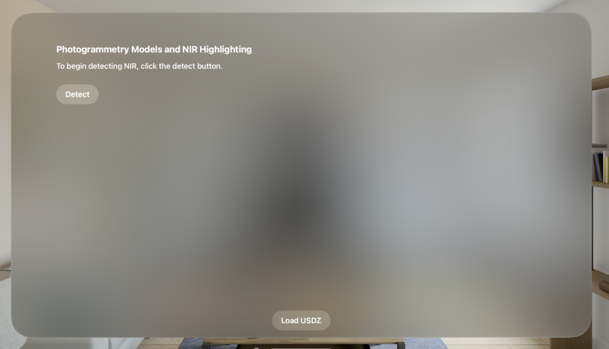

# Augmented-Reality Surgical Device

#### [Project Report](https://docs.google.com/document/d/1bnFGWditMPeq1qzxK1kd7uv6v_H7xCjCT8Ha8rW6Sdk/edit?usp=sharing)

## A Comprehensive Approach to Tumor Detection using RGB, NIR, and Immersive 3D Visualization

**By**  
Yue (Amy) He  
Zach Mizrachi  
TJ Shapiro  

**Final Report for ECE445, Senior Design, Spring 2024**  
**TA**: Jason Zhang  
**May 1, 2024**  
**Project No. 69**

---

## Abstract

The growing influence of technology in surgical fields has led to advances in patient safety and increased efficiency of procedures across the board. Specifically, vision modules have enabled doctors to explore areas that were previously undiscoverable by the human eye. Separately, the state of the art in 3D modeling software has led to the generation of accurate 3D models of physical objects with low processing times on high performing processors. In this study, we further explore the application of technological systems in surgery via a combination of the aforementioned innovations. We introduce a novel sensing to 3D modeling and visualization pipeline, taking advantage of low cost CMOS image sensors, and open source state of the art photogrammetry algorithms to detect, capture, model, and interact with tumorous regions in a cancer patient.

---

## Contents

1. Introduction
    - 1.1 Problem
    - 1.2 Solution
    - 1.3 Visual Aid
    - 1.4 High Level Requirements
2. Design
    - 2.1 Block Diagram
    - 2.2 Casing Module
        - 2.2A Design Procedure
        - 2.2B Design details
    - 2.3 Imaging Module
        - 2.3A Design Procedure
    - 2.4 PCB Module
        - 2.4A Design Procedure
        - 2.4B Design details
    - 2.5 3D Reconstruction Module
        - 2.5A Design Procedure
        - 2.5B Design details
    - 2.6 AR Visualization Module
3. Design Verification
    - 3.1 Casing Module
    - 3.2 Imaging Module
    - 3.3 PCB Module
    - 3.4 3D Reconstruction Module
    - 3.5 AR Visualization Module
4. Costs
6. Conclusion
    - 6.1 Accomplishments
    - 6.2 Uncertainties
    - 6.3 Ethical Considerations
    - 6.4 Future Work

---

## 1. Introduction

### 1.1 Problem

The prevailing method for tumor removal, traditional surgery, presents significant challenges due to its reliance on the surgeon's visual and tactile feedback, which are prone to human error. This approach often results in suboptimal outcomes due to limitations in tumor visibility and the potential for unintended damage to surrounding tissues. Additionally, traditional surgery may necessitate excessive tissue manipulation to enhance tumor visibility, thereby increasing patient morbidity. Consequently, there is a critical need for innovative solutions that mitigate these limitations and enhance the precision and efficacy of tumor removal procedures.

### 1.2 Solution

Our proposed solution addresses the limitations of traditional tumor removal procedures by introducing a compact and mobile camera system designed to augment the surgeon's capabilities. The system will focus on two primary tasks: tumor detection through segmentation from surrounding tissue and 3D reconstruction of the identified tumor. To achieve this, we will integrate a tumor-detecting pen system, validated in a pilot study, which utilizes fluorescent drugs to differentiate between tumor and healthy tissue. In practice, the system will be deployed in conjunction with an Apple Vision Pro to provide real-time visualization of the surgical site. Utilizing augmented reality, the system will highlight the tumor based on near-infrared (NIR) reflection, guiding the surgeon's movements for precise tumor removal. Simultaneously, this augmented reality visualization will facilitate the capture of accurate images for subsequent reconstruction. Post-operatively, advanced image processing techniques will be employed to generate a detailed 3D model of the tumor, providing the surgeon with enhanced visualization and understanding of the surgical area. By improving the surgeon's visual capabilities and facilitating informed decision-making throughout the tumor removal process, our solution aims to enhance surgical outcomes and patient care.

### 1.3 Visual Aid

### 1.4 High Level Requirements

The project aims to achieve specific hardware and software requirements for developing a tumor-detecting camera system. Hardware tasks include 3D printing a casing with an adjustable distance from the camera sensors to the beam splitter, assembling electrical components correctly, and integrating an IMU with the PCB. Software objectives involve receiving and validating RGB, NIR, and IMU data on an NVIDIA Jetson, filtering RGB images by the NIR region of interest, and running open Structure-From-Motion software on the Jetson. Additional software goals are to enhance the SFM model using IMU data, perform optimal frame selection with the IMU, and establish communication between the Jetson and Vision Pro for augmented reality tumor highlighting. The system should enable viewing and interaction with the 3D SFM Point Cloud on the Vision Pro, improving surgical visualization and decision-making.

---

## 2. Design

### 2.1 Block Diagram

### 2.2 Casing Module

#### 2.2A Design Procedure

There were several main considerations for approaching the design for the casing module. Firstly, it needs to hold all relevant sensors and optical pieces securely and accurately. This involves creating a horizontally and vertically aligned path in 3D space for a beam of light to come from the C-mount lens, through the beam splitter and filters, and into the camera sensors. Secondly, the sensitivity of the IMX-219 NIR and visible light sensors necessitates an adjustable focal length in order to obtain focussed images from the sensors to be used in NIR detection and photogrammetry. Thirdly, the casing must allow for external header access to route the MIPI-CSI ribbons as well as the PCB header wires to the NVIDIA Jetson. In addition to the above, the casing must provide full light blockage such that the image on the CMOS sensors is not corrupted by external light filtration. With intention to keep the handheld device lightweight, we looked towards PLA 3D printing, and we utilized Fusion360 to create the model. With just two main attachable pieces to the design, the print time on an Ultimaker 2 3D printer was under 8 hours.  

#### 2.2B Design details

Following up on the above considerations, the final design for the imaging system elevates the beam splitter and depresses the filters to create vertical alignment for the beam to optimally pass through without interference. We also employ the use of M4 screws, screw inserts, and linear bearings to enable the screw-controlled linear actuation of the CMOS sensors for focal length adjustment. With this, we print clips using flexible filament in order to clamp the screws in their set position during the devices’ use. Additionally, we build a lid to press fit the imaging components into their slots, and block as much light as possible from entering the device (see 3.1: Design Verification).  See Figure 1 in the appendix.

### 2.3 Imaging Module

As seen above, the imaging module employs a CMount Lens, a beam splitter, a Visible light filter, and an NIR filter. The goal of this is to create two separate beams carrying the same image, one filtered for NIR light and one filtered for visible light. The CMount lens requires a focal length of 17.5 millimeters. For this project, all components related to imaging are commercially available from Digikey and related websites. For the NIR and Visible light sensors, we remove the lens that comes stock to each board. This required the use of a heat gun to melt the adhesive plastic material.

### 2.4 PCB Module

#### 2.4A Design Procedure

The goal of the PCB is to hold an IMU unit (ICM-20948 chip) and transfer the accelerometer data to Jetson Nano via I2C communication. Therefore, the remaining aspects of the PCB design serve to complement and support the functionality of the IMU. Due to the simple purpose of the PCB, the design process was fairly simple, and the major challenge lay in soldering the PCB, as the IMU and the voltage regulator were both too small to be hand-soldered. We managed to solder the PCB successfully using a microscope, flux, and soldering paste.

#### 2.4B Design details

**IMU:**  
The IMU works at 1.8 Volts and communicates with the Jetson Nano with I2C communication, sending its 9-degrees-of-freedom data to the Nano for further processing.  
**Power supply:**  
According to the datasheet, the IMU needs 1.8 Volts to operate, but the power source, Jetson Nano, can only provide 5 Volts, which led us to incorporate a linear voltage regulator to decrease the voltage from 5V to 1.8V.  
**Pull up and shift:**  
Since we’re using the I2C communication, our device communicates over a two-wire bus consisting of a Serial Data Line (SDA) and a Serial Clock Line (SCL). These lines are open-drain, meaning that each device can only pull the line low but cannot drive it high. To bring the line back to a high state (logic 1), pullup resistors are used, which is why we included the BSS138DWQ-7 chip featuring two MOSFETs that enable the pull up and shift.  
**Pin Headers:**  
To establish and maintain communication between the PCB (slave) and the Jetson Nano (master) on the I2C bus, we included a 4-pin header in our design. The SCL (Serial Clock Line) carries the clock signal, the SDA (Serial Data Line) facilitates bidirectional data transfer, the VCC pin is connected to the Jetson Nano for the 5V power supply, and the GND pin ensures proper electrical grounding.  

### 2.5 3D Reconstruction Module

#### 2.5A Design Procedure

The pipeline from photo capture to 3D modeling has several key requirements to ensure a successful and useful product. Firstly, with capturing photos, we ensure that the photos are stabilized, focused, and high quality. To accomplish this, we utilize the IMU to perform an “optimal frame selection”, which will be described in the following section. The following step in the pipeline involves transferring the photos from the Jetson Nano to the Mac for processing. We utilize TCP/IP communication for this, as described below. Finally, upon receiving images in the xcode environment, we utilize Apple’s “Object Capture” API to perform photogrammetry. 

#### 2.5B Design details

Once we have captured an acceptable amount of images via our optimal frame selection process, we begin transferring them from the Jetson to the Mac via a Secure Copy Protocol (SCP) based connection. This involves a client-server socket relationship to transfer the folder of images into the XCode environment on the Mac for use in photogrammetry. On the server side (Jetson) this is embedded within our script for capturing images using the CSI ports, placing the images in an easily accessible directory. On the client side (Mac), once correct SSH connection settings are in place, we can run the script establishing a single TCP connection (see code below). 

After receiving images via the above process, Apple’s Object Capture generates a USDZ file on the client side. This USDZ file can then be handled in our Xcode application for viewing and interacting.

### 2.6 AR Visualization Module

To reiterate, this section involves using the NIR camera to highlight the tumorous regions in semi-real time within the augmented reality framework provided by the Apple Vision Pro, as well as viewing and interacting with already generated models. In order to accomplish this, several factors are considered. Firstly, the data streaming from the IMU sensor to the Jetson as well as the Jetson to the Mac is low latency. With this low latency, we can achieve the illusion of semi-real time discovery of the tumorous regions as they are explored with our camera device. Secondly, the position of the tumor in 3D space is fixed to the environment, since we are operating under the assumption that the tumorous region is not moving in the real world plane. Moreover, in regards to interacting with the 3D model, we require that the user be able to interact with the model in terms of translation throughout the 3D space, and that the user can change the size of the model.  

In order to implement the above functionality, ARKit and SwiftUI from Apple were utilized. We build an “Immersive Space” which expands the structure of the application from a limited box of specific volume to the entire viewable space. We implement a “File Picker” element that allows the user to seamlessly view the currently generated model as well as any previous model that has been generated. We chose to use “entities” as the data structure to contain our 3D models instead of “Model3D” to provide room for the development of advanced functionality such as animations, physics, materials in a future iteration of the project. 

---

## 3. Design Verification

### 3.1 Casing Module

The main requirements of the casing module were all satisfied. The 3D print functions as expected, with a screw to actuate both sensors toward and away from the beam splitter and filters. We utilized a dial caliper to ensure that the model printed accurately, and verify via measurement that the imaging components have horizontal/vertical alignment. In the assembly of the device, the 3D printed lid successfully press-fits the imaging components into their slots, making the system robust to sudden movements.

### 3.2 Imaging Module

Part of the imaging module requirements were satisfied, while some failed to verify. Our system fails to achieve focused images out of the imaging module. This is due to the system not blocking all light from interfering with the sensor Namely, the light that penetrates through the camera cable and PCB header slots in the lid likely interferes with the reading we receive from the sensor. The system successfully receives input from the visual light and NIR sensors simultaneously. To do this, we utilize various multithreading techniques to fully capture image data from both CSI ports. The Nvidia Jetson Nano Developer Kit does not natively support use of both CSI camera ports at once. However, this is only when you consider single-threaded use cases. When enabling multithreading capacity, we are able to capture two simultaneous streams running at 30 fps. We specifically aimed for low latency and high FPS. In our design document we required less than 0.25 seconds of latency from cameras to the Jetson, with photos being sent to the Jetson at a minimum rate of 20 fps. See figure 4 in the appendix.

### 3.3 PCB Module

An integral part of constructing the 3D model is the image quality of the objects. To facilitate this, we perform “optimal frame selection” using the IMU. This involves a script that performs a series of steps to collect acceleration data and analyze it to capture an optimal frame. First, we initialize the I2C communication protocol between the Jetson and the IMU. To do this, we use the GPIO on the Jetson and wire the necessary pins to the I2C header on our PCB (see figure below). Once the connections are established, we read the WhoAmI register(0x68) to verify proper connection. If it returns the device signature 0xea, then we have established a reliable connection and can begin reading data from the IMU. Then, we wake the IMU by setting the start register(0x01) high, selecting the best clock source, and enabling the accelerometer register(0x00) on all axes. Finally, we activate the two cameras connected to the CSI ports for capture. Images are only captured when the acceleration read from the IMU is below a certain threshold, resulting in a stable image. See Figure2 in the appendix.

### 3.4 3D Reconstruction Module

Our system successfully verifies all requirements in regards to 3D modeling. We see according to Figure 5 that high quality mesh reconstruction can be maintained with as low as 5 photos, taking only six seconds for photogrammetry to run, outperforming the 20 second limit we imposed on ourselves. 

### 3.5 AR Visualization Module

To reiterate, this module is responsible for interacting with generated 3D models and visualizing the NIR detections in augmented reality via the Apple Vision Pro. We succeed in verifying all functionality components in regards to the 3D model in the vision pro environment, namely, the translation and resizing functionality. We also demonstrate the successful implementation of the file picker element, allowing the user to pick between all available 3D models.

We failed to enable NIR data streaming within our Xcode environment. This process requires multithreading in swift, and due to the timing constraints of the project, we came up short on time to implement it. However, we implemented the second half of this part of the system, where we abstract away the incoming NIR, and generate a 3D highlight for an NIR “detection” . The 3D highlight stays in its position relative to the environment, therefore part of our requirement for this section.

---

## 4. Costs

| Part                                    | Manufacturer              | Part Number                 | Quantity | Cost per Unit |
|-----------------------------------------|---------------------------|-----------------------------|----------|---------------|
| CMOS Sensor                             | Leopard Imaging Inc.      | LI-IMX219-MIPI-FF-NANO-H90  | 2        | $29           |
| NIR Sensor                              | Leopard Imaging Inc.      | LI-OV5640-MIPI-AF-NIR       | 2        | $45           |
| Light Filter                            | N/A                       | N/A                         | 1        | N/A           |
| NIR Filter                              | N/A                       | N/A                         | 1        | N/A           |
| Beam Splitter                           | N/A                       | N/A                         | 1        | N/A           |
| Lens                                    | N/A                       | N/A                         | 1        | N/A           |
| IMU                                     | TDK InvenSense            | ICM-20948                   | 11       | ~$8.64        |
| MOSFET                                  | Diodes Incorporated       | BSS138DWQ-7                 | 11       | $0.42         |
| Voltage Regulator                       | Microchip Technology      | MIC5504-1.8YM5-TR           | 11       | $0.16         |
| Casing                                  | Proprietary               | N/A                         | 2        | $16           |
| Flex Cable for Raspberry Pi Camera      | Adafruit                  | Product ID: 1731            | 4        | $2.95         |
| CSI or DSI Cable Extender Thingy for Raspberry Pi | Adafruit      | Product ID: 3671            | 4        | $2.95         |
| **Total cost**                          |                           |                             |          | **$305.02**   |

---

## 5. Conclusion

### 5.1 Accomplishments

This project highlights the potential for vision and modeling technology to change the way doctors can interact with patients during surgical operations. We successfully demonstrate the ease in which cutting-edge API’s for object modeling can be layered on top of low cost sensing modules to create efficient object visualization and interaction pipelines.

### 5.2 Uncertainties

The key uncertainties in this project lie from optics related issues with light filtration, and data streaming issues in regards to NIR. The former issue may be resolved with a potential redesign of the casing module’s lid, to clamp exit holes such that no light may enter. The later issue may be amended by implementing an instance of multithreading in swift.]*

### 5.3 Ethical Considerations

There are various moral and ethical considerations that need to be made when fully employing this project, specifically in regards to patient data and confidentiality. Since this project’s purpose is to take pictures during surgery in the operating room, it is critical that this information is stored only to be viewed by the surgeon and staff. Otherwise, all photos and models should be immediately discarded upon exit of our application. It is necessary for all data to be discarded on both the Mac side and Jetson Nano side. We have accomplished this by deleting the image directory as soon as the TCP connection is dropped.

### 5.4 Future Work

The opportunities for future development in this project are endless. Assuming that the above uncertainties are resolved, there is immense potential in increasing the utility of the Vision application that we created. For instance, in our application, we provide the ability to move and resize the model. However, one could also map the model onto the object in real life, and use NIR highlighting to display tumorous regions on the surface of the patient themselves. In regards to sensing, the models will only improve in quality using systems with better cameras. However, in this project we keep things as low cost as possible.

---
